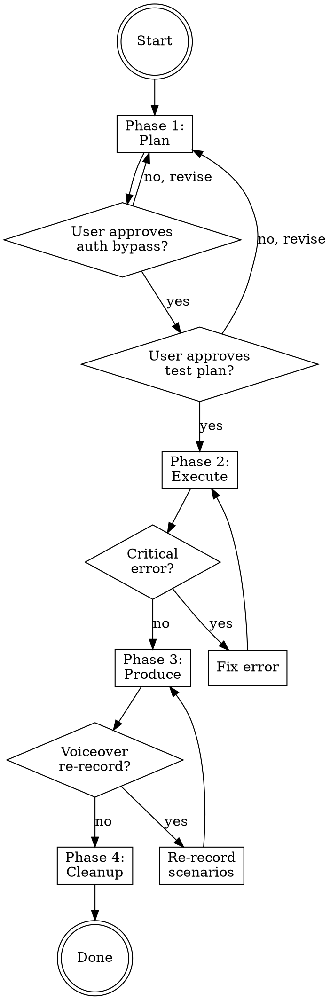

# E2E Demo

Run E2E tests on a web app using Playwright. Produces a full demo video (Remotion, with captions) and a markdown user manual with screenshots. QA is the primary goal; demo artifacts are a natural byproduct.

## Quick Reference

| Phase | What Happens | Subagents |
|-------|-------------|-----------|
| **1. Plan** | Explore codebase, propose auth bypass, generate test plan | None (orchestrator) |
| **2. Execute** | Run Playwright tests, record video, capture screenshots | Test Executor + Error Watcher |
| **3. Produce** | Compile video with Remotion, write user manual | Video Compiler + Doc Writer |
| **4. Cleanup** | Revert auth bypass, present summary | None (orchestrator) |

## When to Use

- User asks to run E2E tests on a web app
- User wants a demo video or user manual generated from testing
- User wants to QA a web application with visual artifacts
- User says "test the app end-to-end" or "create a demo"

## When NOT to Use

- Unit or integration testing (no browser needed)
- Testing APIs without a frontend
- Mobile/native app testing

## Workflow



---

## Phase 1: Plan

You (the orchestrator) handle this phase directly — no subagents.

### Step 1: Explore Codebase

1. Read `package.json` — confirm React/Next.js, note auth libraries
2. Scan route structure (`app/` or `pages/`) — map all navigable pages
3. Read auth implementation — identify OTP provider, captcha integration, login flow
4. Identify key user flows from components and navigation

### Step 2: Propose Auth Bypass

Read `reference/auth-bypass-patterns.md` for common strategies.

1. Propose specific code changes to create a debug user:
   - `E2E_DEBUG_USER=true` env var controls the bypass
   - Skips OTP verification for debug email
   - Bypasses captcha validation
   - Uses hardcoded debug credentials
2. Produce a **revert checklist** (JSON array of `RevertEntry` objects — see types.ts)
3. Present changes to user and **wait for approval**
4. Apply approved changes

### Step 3: Generate Test Plan

1. Combine user's direction + codebase exploration to build test scenarios
2. Each scenario: id, name, description, ordered steps with selectors and wait conditions
3. Run: `npx tsx <skill-dir>/scripts/validate-test-plan.ts test-plan.json`
4. Present test plan to user and **wait for approval**

See `reference/timing-data-format.md` for the test plan JSON schema.

---

## Phase 2: Execute

Dispatch two subagents in parallel:

### Test Executor (background)
- Prompt: `prompts/test-executor.md`
- Provide: approved test plan JSON, debug credentials, project root path
- Produces: recordings, screenshots, timing-data.json, error-log.json, test-report.md

### Error Watcher (background)
- Prompt: `prompts/error-watcher.md`
- Monitors: `e2e/error-log.json`
- Halts testing by creating `e2e/HALT_TESTING` if critical error found

### On Halt

If `e2e/HALT_TESTING` appears:
1. Read `e2e/HALT_REASON.md` for error details
2. Present error to user
3. Decide: fix the error and resume, or skip scenario and continue
4. If fixing: apply fix, delete HALT files, re-dispatch test executor for remaining scenarios
5. If skipping: delete HALT files, note skipped scenario, continue

### On Completion

When test executor reports DONE:
1. Check error watcher status
2. Review test-report.md — if any failures, ask user whether to proceed to Phase 3

---

## Phase 3: Produce

Dispatch two subagents in parallel:

### Video Compiler
- Prompt: `prompts/video-compiler.md`
- Reference: `reference/remotion-guide.md`
- Provide: project root, skill dir, voiceover flag
- Produces: `e2e/output/demo-full.mp4`

### Doc Writer
- Prompt: `prompts/doc-writer.md`
- Provide: project root, app name
- Produces: `e2e/output/user-manual.md`

### Voiceover Re-Record Loop

If video compiler reports NEEDS_RERECORD:
1. Note which scenarios need longer recordings and by how much
2. Re-dispatch test executor for those scenarios with extended dwell times
3. Re-dispatch video compiler with updated recordings
4. Repeat until durations match

---

## Phase 4: Cleanup

You handle this directly.

1. Read revert checklist from Phase 1
2. Restore each file to its original content
3. Smoke test: launch app, confirm login page shows captcha and OTP flow
4. If revert fails: stop and ask user
5. Present completion summary:

```
E2E Testing Complete
─────────────────────
Scenarios: N passed, N failed
Duration: Xm Xs total

Outputs:
  Test report     → e2e/test-report.md
  Demo video      → e2e/output/demo-full.mp4
  User manual     → e2e/output/user-manual.md
  Raw recordings  → e2e/recordings/
  Screenshots     → e2e/screenshots/
  Timing data     → e2e/timing-data.json

Auth: Debug user reverted, production auth restored
```

---

## Key Rules

1. **No static waits** — always wait for DOM elements or network conditions
2. **UI-only navigation** — `page.goto()` only for initial URL, everything else via UI clicks
3. **User gates** — never proceed without user approval at auth bypass and test plan stages
4. **Error-first** — halt and fix before accumulating broken test results
5. **Clean revert** — every auth change must be tracked and restored

## References

- **Playwright patterns**: `reference/playwright-patterns.md`
- **Remotion guide**: `reference/remotion-guide.md`
- **Auth bypass strategies**: `reference/auth-bypass-patterns.md`
- **Timing/report formats**: `reference/timing-data-format.md`
